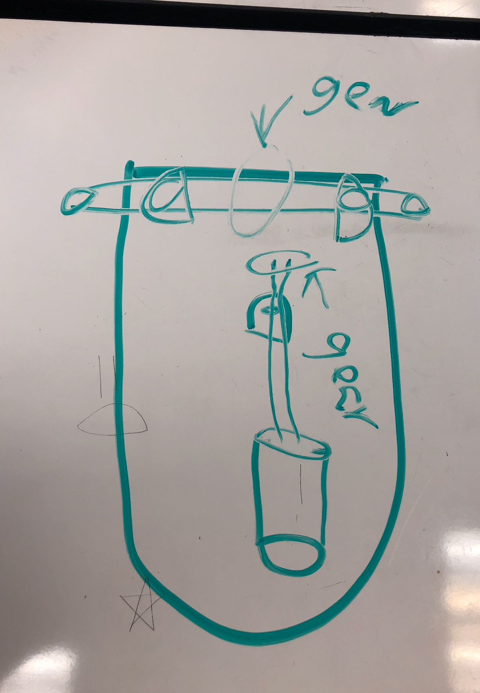
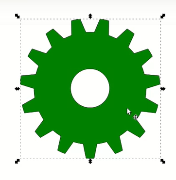

## first commit
We plan on powering the cart with only one motor. This will be acomplish through gears. 
There will be a gear on the rear axel. There will also be a gear connnected to the motor.
The Gears will be perpendicular to eachother and will turn with eachother. 

