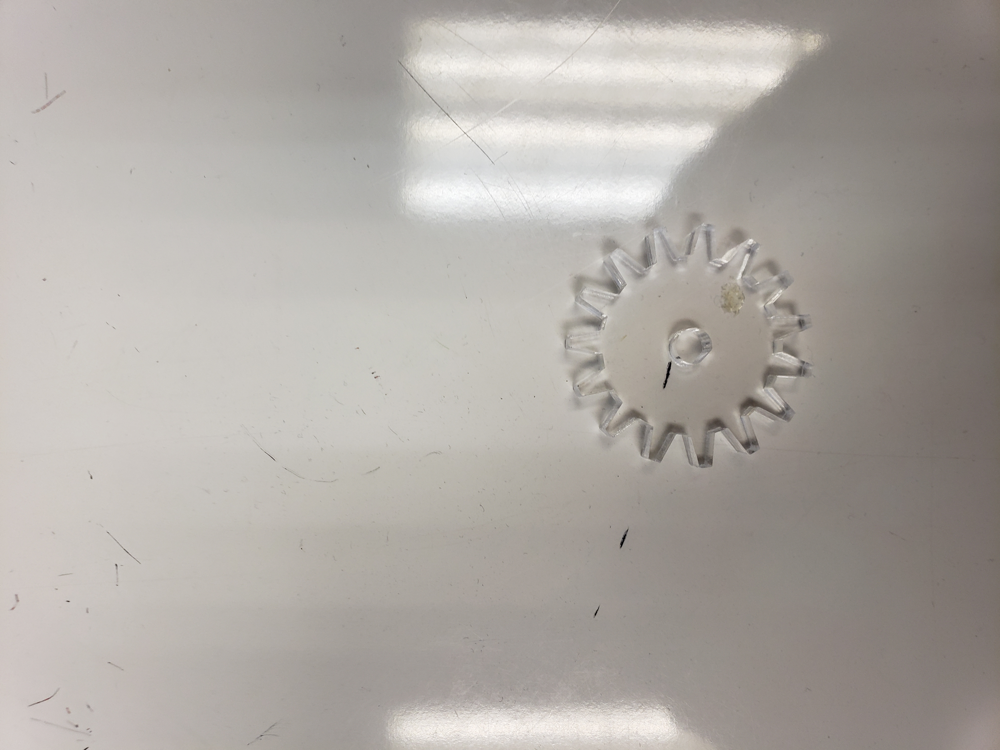

## Go Go Cart
We plan on powering the cart with only one motor. This will be acomplished  through gears. 
There will be a gear on the rear axel. There will also be a gear connnected to the motor.
The Gears will be parallel to eachother and will turn with each other. 
There will also be a servo in the front that will turn the front wheels back and forth. 

We havent updated any of the modeling yet but we are still trying to get all the electrical components to work together. 
We got a demo to make the motor spin purely to make sure we could get it to work with the motor controller.
currently we are able to have the motor spinning and control the servo with the remote controll. our next step is to
get the motor to only spin if receiving comands from the remote and not constantly spinning. 

The two channels of the remote controller is connected to the motor and the servo. The wheel controls the servo while the trigger controls the motor. 

We have made many designs of gears to make the motor the car go faster. Making progress in trying to make the front wheels turn.

The car base has been modeled and we cut out the carbon fiber to make it an axle for the wheels. 

Having the wheels turn through the axle and move without interfering with the car base. We used ball bearing, created a tiny piece for the axle to go through the ball bearing, and a 3D-printed base to glue the ball bearings onto the car base. 

We placed the circuit, red board, motor, the battery pack, and receiver all on the car base. We attached the wheels and all the other components to finalize it. 

